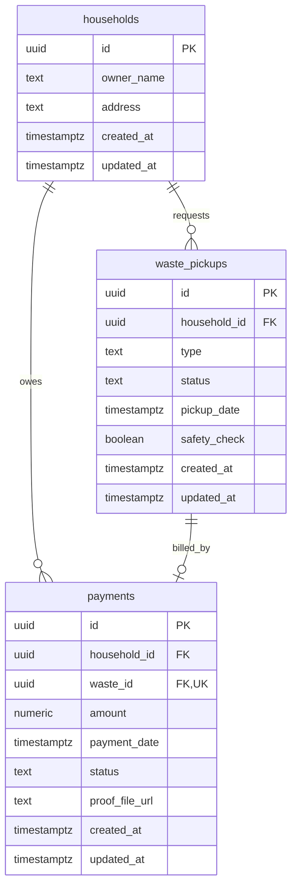

# Desain Database

## 1. Prinsip

Saya memakai PostgreSQL 17 dengan tiga tabel bisnis: households, waste_pickups, dan payments. Session database menggunakan timezone UTC. UUID dibuat aplikasi; waktu disimpan `TIMESTAMPTZ`; uang `NUMERIC(12,2)`; type/status `TEXT` dengan CHECK untuk membatasi nilai type dan status. Tidak menggunakan float untuk amount.



## 2. Data dictionary

### households

| Column | Type | Null | Default | Validation |
| --- | --- | --- | --- | --- |
| id | UUID | No | App-generated | PK |
| owner_name | VARCHAR(150) | No | None | Trimmed; 1–150 characters |
| address | VARCHAR(1000) | No | None | Trimmed; 1–1000 characters |
| created_at | TIMESTAMPTZ | No | CURRENT_TIMESTAMP | Server-managed |
| updated_at | TIMESTAMPTZ | No | CURRENT_TIMESTAMP | Server-managed |

Owner name dan address tidak unique; dua household boleh memiliki nilai sama. CHECK `char_length(btrim(owner_name)) > 0` dan setara address mencegah string kosong dasar; aplikasi juga trim whitespace Unicode. Panjang dihitung sebagai karakter, bukan byte.

### waste_pickups

| Column | Type | Null | Default | Validation |
| --- | --- | --- | --- | --- |
| id | UUID | No | App-generated | PK |
| household_id | UUID | No | None | FK households.id |
| type | TEXT | No | None | organic, plastic, paper, electronic |
| status | TEXT | No | pending | pending, scheduled, completed, canceled |
| pickup_date | TIMESTAMPTZ | Yes | NULL | Required for scheduled/completed |
| safety_check | BOOLEAN | Yes | NULL | Non-null for electronic; NULL for other types |
| created_at | TIMESTAMPTZ | No | CURRENT_TIMESTAMP | Server-managed |
| updated_at | TIMESTAMPTZ | No | CURRENT_TIMESTAMP | Set explicitly on updates |

Create electronic tanpa field safety_check harus ditolak oleh DTO yang membedakan omitted/null dari false. False valid pada pending/canceled, tetapi scheduled/completed electronic wajib true.

CHECK utama sebagai acuan migration:

```sql
CHECK (type IN ('organic', 'plastic', 'paper', 'electronic')),
CHECK (status IN ('pending', 'scheduled', 'completed', 'canceled')),
CHECK (
  (type = 'electronic' AND safety_check IS NOT NULL)
  OR (type <> 'electronic' AND safety_check IS NULL)
),
CHECK (status NOT IN ('scheduled', 'completed') OR pickup_date IS NOT NULL),
CHECK (status <> 'pending' OR pickup_date IS NULL),
CHECK (
  type <> 'electronic'
  OR status NOT IN ('scheduled', 'completed')
  OR safety_check IS TRUE
)
```

CHECK memastikan kondisi row saat ini, **bukan riwayat transisi**. Validasi pending→scheduled dan scheduled→completed tetap tanggung jawab service.

### payments

| Column | Type | Null | Default | Validation |
| --- | --- | --- | --- | --- |
| id | UUID | No | App-generated | PK |
| household_id | UUID | No | None | FK households.id + ownership consistency |
| waste_id | UUID | No | None | Unique; references waste_pickups |
| amount | NUMERIC(12,2) | No | None | Positive, finite; tariff enforced in service |
| payment_date | TIMESTAMPTZ | Yes | NULL | Required when paid |
| status | TEXT | No | pending | pending, paid, failed |
| proof_file_url | VARCHAR(500) | Yes | NULL | Non-empty relative URL when paid |
| created_at | TIMESTAMPTZ | No | CURRENT_TIMESTAMP | Server-managed |
| updated_at | TIMESTAMPTZ | No | CURRENT_TIMESTAMP | Set explicitly on updates |

Constraint amount yang aman juga menolak nilai khusus: `CHECK (amount > 0 AND amount <= 9999999999.99)`; validasi API menolak non-decimal, exponent, negatif, nol, dan lebih dari dua digit pecahan sebelum cast. Jangan mengandalkan pembulatan NUMERIC untuk menerima input invalid.

CHECK state payment:

```sql
CHECK (status IN ('pending', 'paid', 'failed')),
CHECK (
  (status = 'paid'
   AND payment_date IS NOT NULL
   AND proof_file_url IS NOT NULL
   AND char_length(btrim(proof_file_url)) > 0)
  OR
  (status IN ('pending', 'failed')
   AND payment_date IS NULL
   AND proof_file_url IS NULL)
)
```

`failed` di versi ini adalah record tanpa konfirmasi berhasil. Bila nanti failed harus menyimpan bukti/attempt, desain perlu direvisi.

## 3. Relationships dan integritas

| Constraint | Tujuan |
| --- | --- |
| waste_pickups.household_id → households.id, ON DELETE RESTRICT | Tidak ada pickup orphan |
| payments.household_id → households.id, ON DELETE RESTRICT | Tidak ada payment orphan |
| UNIQUE waste_pickups(id, household_id) | Target composite FK agar household cocok |
| FK payments(waste_id, household_id) → waste_pickups(id, household_id), ON DELETE RESTRICT | Tidak ada payment household A untuk pickup household B |
| UNIQUE payments(waste_id) | Satu invoice maksimum per pickup |

Tidak memakai cascade delete. UUID dan ownership tidak dapat diubah melalui API. Composite FK sudah menghubungkan waste_id ke pickup; FK terpisah waste_id tidak diperlukan.

**Invariant service:** setiap completion sukses memiliki tepat satu invoice dengan tarif benar. FK dan unique hanya menjamin referensi serta maksimal satu invoice; tidak menjamin setiap completed row memiliki invoice atau tarif mengikuti type. Transaksi service dan integration test menjaga bagian ini. Tidak memakai trigger lintas tabel untuk versi ini.

## 4. Index plan

PK dan UNIQUE otomatis menyediakan index pendukungnya; jangan membuat index identik kedua.

| Index tambahan | Query target |
| --- | --- |
| households(created_at DESC, id DESC) | List household |
| waste_pickups(created_at DESC, id DESC) | List tanpa filter |
| waste_pickups(household_id, created_at DESC, id DESC) | Filter household dan lookup referensi delete |
| waste_pickups(status, created_at DESC, id DESC) | Filter status |
| payments(created_at DESC, id DESC) | List tanpa filter |
| payments(household_id, created_at DESC, id DESC) | Filter household |
| payments(status, created_at DESC, id DESC) | Filter status |
| payments(household_id) WHERE status='pending' | EXISTS pending payment saat create pickup |
| payments(payment_date) WHERE payment_date IS NOT NULL | Filter rentang tanggal |

Filter gabungan status+household tetap benar tanpa index empat kolom khusus. Tambahkan hanya bila EXPLAIN dan data uji menunjukkan kebutuhan. Agregasi seluruh data mungkin memang menggunakan scan tabel.

## 5. Migration lifecycle

Urutan file:

1. `000001_create_households.up.sql` / `.down.sql`.
2. `000002_create_waste_pickups.up.sql` / `.down.sql`.
3. `000003_create_payments.up.sql` / `.down.sql`.

Index dan constraint ditempatkan dalam migration tabel terkait. Down berjalan payments → pickups → households. Tidak menjanjikan down migration aman untuk data: rollback tabel menghapus data dan hanya diuji di database disposable.

Gunakan golang-migrate/v4 sebagai migration runner dan kunci versi yang dipakai pada build. Compose memakai service `migrate` one-shot setelah postgres healthy; app menunggu migrate sukses. Tidak mengandalkan `/docker-entrypoint-initdb.d` sebagai sistem migration berkelanjutan karena volume existing juga perlu upgrade schema. Kegagalan migration harus menghentikan startup app, bukan diabaikan.

## 6. Seed specification

Seed terpisah dari schema migration, eksplisit, transactional, UUID deterministik, idempotent. Tidak menghapus data reviewer atau mereset paid menjadi pending. Fixtures development diberi nama jelas dan hanya data fiktif.

| Household | Pickup fixtures | Payment fixtures |
| --- | --- | --- |
| Seed A | organic pending, plastic completed | plastic pending 50000 |
| Seed B | electronic pending dengan false | Tidak ada |
| Seed C | paper scheduled, electronic completed | electronic paid 100000 dengan proof sample lokal |
| Seed D | paper completed, organic canceled | paper failed 50000 |

Seed harus membuat sample PNG/JPEG valid untuk paid proof atau meng-copy asset sample yang di-commit khusus seed. Jangan seed URL yang menunjuk file tidak ada. Jalankan dua kali: count tetap sama, state yang telah berubah lewat API tidak ditimpa.

Hasil seed pertama pada database kosong: 4 households, 7 pickups, 3 payments; pending=1, paid=1, failed=1; total revenue=`100000.00`. Tanggal fixture tetap dan ditulis di seed agar filter tanggal dapat diuji secara deterministik. A terblokir membuat pickup; B/C/D tidak terblokir oleh rule pending payment.

## 7. Query semantics

- Pending check memakai `EXISTS`, bukan menghitung semua row.
- Pagination: COUNT dan page query memakai predicate identik; snapshot konsisten dalam satu response bila dua statement, misalnya read-only REPEATABLE READ.
- Offset pagination dapat bergeser antar-request saat data berubah; ini tradeoff yang diterima untuk scope tes.
- Filter date start inklusif `>= start UTC`; end eksklusif `< midnight setelah end_date UTC`.
- Waste report mengelompokkan type/status; payment report menghitung count, sum per status, dan revenue paid dari snapshot yang sama.
- Gunakan parameter SQL untuk input; nama kolom sort tidak berasal dari input client.

## 8. Nama constraint

Saya ingin constraint diberi nama yang jelas supaya error repository bisa dipetakan tanpa menebak teks error driver.

| Tabel | Nama dan makna |
| --- | --- |
| households | households_pkey; households_owner_name_check; households_address_check |
| waste_pickups | waste_pickups_pkey; waste_pickups_household_id_fkey; waste_pickups_id_household_id_key |
| waste_pickups | waste_pickups_type_check; waste_pickups_status_check; waste_pickups_safety_presence_check |
| waste_pickups | waste_pickups_scheduled_date_check; waste_pickups_pending_date_check; waste_pickups_electronic_safety_check |
| payments | payments_pkey; payments_household_id_fkey; payments_waste_household_fkey; payments_waste_id_key |
| payments | payments_amount_check; payments_status_check; payments_confirmation_check |

Nama index tambahan mengikuti `idx_<table>_<purpose>`, misalnya `idx_payments_pending_household`. Migration dijalankan satu per satu, masing-masing dalam transaksi SQL. Jangan memakai CREATE INDEX CONCURRENTLY di dalam migration transactional ini. Tidak ada extension wajib untuk UUID karena UUID dibuat aplikasi.

`created_at` dan `updated_at` memiliki default CURRENT_TIMESTAMP untuk insert langsung/seed. Service tetap mengirim timestamp eksplisit sesuai clock. Tidak ada trigger update timestamp; semua UPDATE repository wajib mengisi updated_at.

## 9. Fixture seed yang dipakai

ID di bawah adalah ID tetap untuk seed saja. API tetap membuat UUID baru. Semua created_at memakai `2026-10-01T00:00:00Z`; updated_at awal sama kecuali ditentukan lain.

### Household

| Label | UUID | owner_name | address |
| --- | --- | --- | --- |
| A | 10000000-0000-4000-8000-000000000001 | Seed Household A | Jalan Contoh A No. 1 |
| B | 10000000-0000-4000-8000-000000000002 | Seed Household B | Jalan Contoh B No. 2 |
| C | 10000000-0000-4000-8000-000000000003 | Seed Household C | Jalan Contoh C No. 3 |
| D | 10000000-0000-4000-8000-000000000004 | Seed Household D | Jalan Contoh D No. 4 |

### Pickup

| Label | UUID | Household | Type | Status | pickup_date | safety_check |
| --- | --- | --- | --- | --- | --- | --- |
| W1 | 20000000-0000-4000-8000-000000000001 | A | organic | pending | null | null |
| W2 | 20000000-0000-4000-8000-000000000002 | A | plastic | completed | 2026-10-02T02:00:00Z | null |
| W3 | 20000000-0000-4000-8000-000000000003 | B | electronic | pending | null | false |
| W4 | 20000000-0000-4000-8000-000000000004 | C | paper | scheduled | 2026-10-08T02:00:00Z | null |
| W5 | 20000000-0000-4000-8000-000000000005 | C | electronic | completed | 2026-10-03T02:00:00Z | true |
| W6 | 20000000-0000-4000-8000-000000000006 | D | paper | completed | 2026-10-04T02:00:00Z | null |
| W7 | 20000000-0000-4000-8000-000000000007 | D | organic | canceled | null | null |

Untuk W2/W4/W5/W6, updated_at mengikuti pickup_date; W7 memakai `2026-10-01T01:00:00Z`. Ini fixture histori dengan waktu tetap, bukan jadwal yang disesuaikan dengan hari komputer menjalankan seed.

### Payment

| UUID | Household / pickup | Amount | Status | payment_date | Proof |
| --- | --- | --- | --- | --- | --- |
| 30000000-0000-4000-8000-000000000001 | A / W2 | 50000.00 | pending | null | null |
| 30000000-0000-4000-8000-000000000002 | C / W5 | 100000.00 | paid | 2026-10-05T03:00:00Z | /uploads/payment-proofs/40000000-0000-4000-8000-000000000001.png |
| 30000000-0000-4000-8000-000000000003 | D / W6 | 50000.00 | failed | null | null |

created_at setiap payment mengikuti updated_at pickup terkait. updated_at payment pending/failed sama dengan created_at; payment paid memakai payment_date. File seed `seeds/assets/sample-proof.png` harus berupa PNG valid dan disalin ke nama final di atas. Isi contoh sederhana sudah cukup, tanpa data pribadi.

Insert household → pickup → payment dalam satu transaksi setelah sample proof tersedia. Gunakan konflik primary key untuk melewati fixture yang sudah ada; jangan melakukan upsert yang mereset state. Jika ID seed bertabrakan dengan record yang mempunyai identitas/relasi berbeda, batalkan seed dan tampilkan error yang jelas. Bila sample file hilang tetapi record paid masih menunjuk path seed, seed boleh memulihkan file tersebut; jangan mengganti proof hasil confirmation pengguna.

Tidak ada fixture completed-tanpa-payment pada seed normal. Fixture tersebut hanya dibuat di integration test untuk menguji POST payment 201.

## 10. Pemisahan data test

Gunakan database `geu_waste_test` untuk integration test. Test harus menolak koneksi yang menunjuk DB utama `geu_waste`; nama database test atau pengaman environment eksplisit diperiksa sebelum reset/truncate. Migration test sama persis dengan aplikasi.

Jangan menjalankan test yang menghapus data melalui DATABASE_URL milik developer. Setiap skenario concurrency mendapat data sendiri. Reset dan rollback schema diuji dalam Compose project disposable, bukan pada volume yang dipakai untuk demonstrasi.
