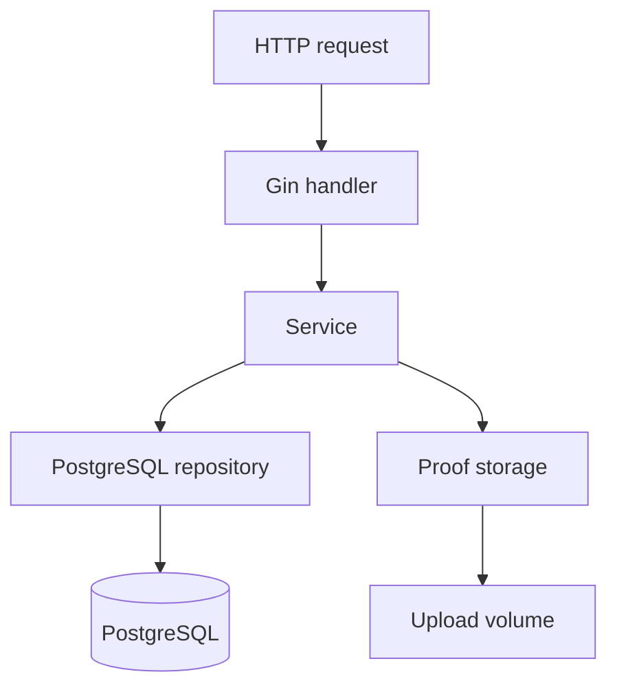
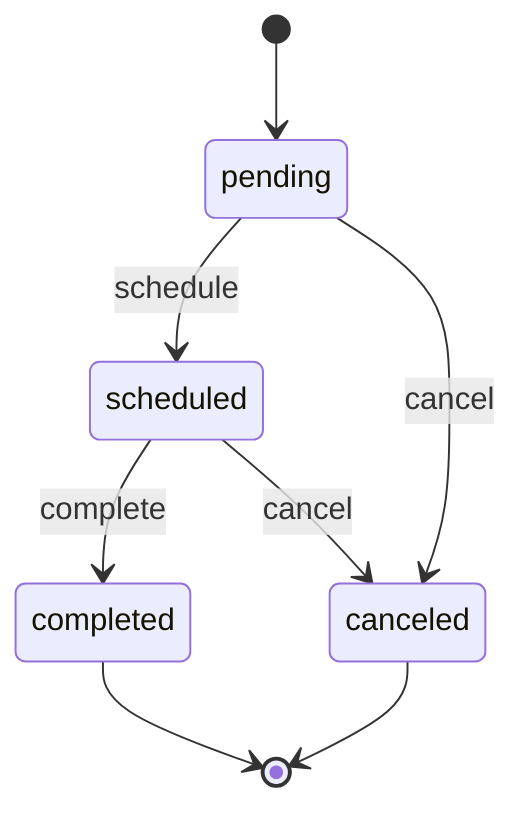

# Desain Aplikasi

## 1. Arsitektur

Saya memilih satu aplikasi Go dengan PostgreSQL dan folder lokal untuk bukti pembayaran. Ukuran project ini belum membutuhkan beberapa service terpisah. Dengan susunan ini, alur request, query, dan transaksi tetap mudah diikuti saat debugging maupun review.

| Komponen | Tanggung jawab | Batas |
| --- | --- | --- |
| Handler | Parse path/query/body, validasi bentuk input, response dan status HTTP | Tidak berisi SQL atau keputusan transaksi |
| Service | Business rules, state transition, tarif, koordinasi transaksi/storage | Tidak bergantung pada gin.Context |
| Repository | Query terparameterisasi, locking, mapping row, agregasi | Tidak memilih status HTTP |
| Domain | Entity, constants, typed errors, fungsi tarif | Tidak bergantung pada Gin/pgx |
| Storage | Validasi konten proof, simpan, hapus, URL relatif | Tidak mengubah payment sendiri |
| Config/bootstrap | Env validation, DB, dependency wiring, lifecycle | Tidak memuat business rule |

Service menerima `context.Context` dari request. Repository menghormati deadline/cancellation. Interface kecil didefinisikan dekat consumer; gunakan interface hanya pada batas yang perlu diganti dalam test, bukan untuk setiap struct.

## 2. Susunan project

| Path | Isi |
| --- | --- |
| cmd/api/main.go | Bootstrap dan lifecycle HTTP |
| cmd/migrate/main.go | Wrapper golang-migrate: up, down satu versi, version; membaca env yang sama |
| cmd/seed/main.go | Seed eksplisit dan idempotent |
| internal/config/ | Load dan validasi env |
| internal/domain/ | Household, pickup, payment, typed errors, tarif |
| internal/handler/ | Handler dan mapping response |
| internal/service/ | Use case dan interface repository/storage yang dikonsumsi |
| internal/repository/postgres/ | Pool, transaksi, query per entity, laporan |
| internal/storage/local/ | Local proof storage |
| internal/http/ | Router, middleware, response helper |
| migrations/ | SQL up/down berurutan |
| seeds/ | Fixture atau data seed pendukung |
| uploads/payment-proofs/ | Runtime files; tidak di-commit |
| tests/integration/ | Test dengan PostgreSQL nyata |
| postman/ | Collection, environment tanpa secret, petunjuk sample proof |
| docs/ | Paket spesifikasi ini |

Sesuaikan nama folder dengan project existing. Hindari import cycle: domain berdiri sendiri; handler mengonsumsi service; adapter repository mengimplementasikan interface service; main melakukan wiring.

## 3. Use-case contracts

Nama berikut merupakan kontrak konseptual, bukan signature Go final.

| Service | Operasi |
| --- | --- |
| HouseholdService | Create, List, GetByID, Delete |
| PickupService | Create, List, Schedule, Complete, Cancel |
| PaymentService | EnsurePayment, List, Confirm |
| ReportService | WasteSummary, PaymentSummary |

Pisahkan request DTO dari entity database. Client tidak boleh menentukan id, status awal, created_at, updated_at, payment_date, atau proof_file_url. Jangan mengekspor semua field struct internal langsung sebagai input.

## 4. State transitions

| Aksi | Prasyarat | Perubahan |
| --- | --- | --- |
| Create pickup | Household ada, tidak ada pending payment | status pending, date NULL |
| Schedule | pending; electronic memiliki effective safety=true | status scheduled, date terisi, safety terbaru tersimpan |
| Complete | scheduled | completed + satu payment pending |
| Cancel | pending atau scheduled | canceled; pickup_date historis dipertahankan jika sudah ada |
| Confirm payment | pending dan proof valid | paid, payment_date sekarang, proof URL terisi |

Repeat schedule/complete/cancel/confirm mendapat 409. Dengan begitu client mendapatkan conflict yang jelas saat mengulang aksi pada state yang sudah berubah. `POST /api/payments` adalah pengecualian yang mengembalikan existing invoice sesuai D01.

`failed` tersedia pada enum pembayaran tetapi tidak dicapai melalui endpoint publik dalam scope ini. Tidak ada auto-fail karena upload invalid: request gagal harus meninggalkan payment pending.

## 5. Transaction boundary dan locking

Repository harus menyediakan transaksi yang dapat dipakai beberapa repository sekaligus. Semua query dalam satu use case transactional memakai objek transaksi yang sama. Jangan memulai transaksi lalu melakukan insert payment melalui pool di luar transaksi.

Gunakan transaksi READ COMMITTED dengan row lock eksplisit. Urutan lock untuk operasi yang melibatkan beberapa entitas: **household → pickup → payment**. Lookup awal untuk menemukan household boleh dilakukan sebelum lock, tetapi keberadaan, kepemilikan, dan status harus dibaca ulang setelah lock. Household pickup bersifat immutable.

### Create pickup

1. BEGIN; lock household `FOR UPDATE`; 404 jika tidak ada.
2. Periksa keberadaan payment pending household dalam transaksi.
3. Bila ada, rollback dan 409; bila tidak, insert pickup pending.
4. COMMIT.

Semua operasi yang membuat payment pending (completion, EnsurePayment) juga lock household yang sama. Maka pemeriksaan pending tidak berlomba dengan pembuatan invoice. Jika create pickup menang lock sebelum completion, create boleh sukses: saat keputusan dibuat memang belum ada payment pending. Rule ini tidak membatasi jumlah pickup pending/scheduled.

### Complete pickup

1. Resolve household, BEGIN, lock household, lalu lock pickup.
2. Revalidate pickup masih ada dan status scheduled; selain itu rollback 404/409.
3. Hitung tarif dari type server-side.
4. Update status completed dan updated_at.
5. Insert payment pending dengan household/waste yang sama dan amount tarif.
6. COMMIT; baru kirim sukses bersama pickup dan payment.

Insert gagal berarti status completion ikut rollback. Unique waste_id tetap menjadi pertahanan terakhir. Dua completion serentak: satu sukses, lainnya melihat completed dan mendapat 409. Tidak ada invoice kedua. Invoice existing pada pickup scheduled adalah data tidak konsisten; rollback dan 409, jangan menimpa invoice.

### EnsurePayment

Lock household lalu pickup, validasi completed + kepemilikan + amount. Jika payment ada dan konsisten, kembalikan existing 200 tanpa mutation. Jika belum ada, insert pending dan return 201 setelah commit. Semua jalur memakai kalkulasi tarif yang sama dengan completion.

### Schedule dan cancel

Lock pickup, recheck state, lakukan update dalam transaksi singkat. Kedua operasi tidak boleh kemudian mengambil household lock; ini menghindari pembalikan urutan lock. Complete dan cancel serentak diserialisasi oleh pickup lock; satu transisi menang.

### Delete household

Lock household dan periksa referensi dalam transaksi. Jika ada pickup/payment, 409; jika tidak, delete. Foreign key RESTRICT tetap wajib agar race atau query di luar service tidak menciptakan orphan.

## 6. Proof upload dan consistency

1. Batasi total body 6 MiB sebelum parsing multipart; tepat satu part file bernama `proof`, ukuran 1 byte sampai 5 MiB.
2. Periksa MIME dari isi dan decode konfigurasi image JPEG/PNG. Lebar/tinggi masing-masing maksimal 10000 piksel dan total maksimal 20 juta piksel. Setelah lolos batas tersebut, decode gambar penuh untuk menolak file terpotong/korup; jangan hanya percaya extension atau Content-Type client.
3. Simpan ke staging dalam filesystem volume yang sama. Nama dibuat server dengan UUID; jangan gunakan nama/path dari client.
4. BEGIN; lock household lalu payment; revalidate payment masih pending.
5. Rename staging menjadi file final secara atomik pada filesystem yang sama.
6. Update status paid, payment_date, proof_file_url, updated_at; COMMIT.
7. Jika gagal sebelum commit yang pasti, rollback dan bersihkan file request ini. Error cleanup dicatat untuk pemeliharaan.

Contoh DB URL: `/uploads/payment-proofs/<uuid>.jpg`; contoh disk: `${UPLOAD_DIR}/<uuid>.jpg`. Jangan menyimpan `/app/...` ke response.

Transaksi DB dan filesystem **tidak atomic bersama-sama**. Crash antara rename dan commit dapat meninggalkan orphan. Bila hasil COMMIT tidak pasti karena koneksi terputus, jangan langsung menghapus file final: periksa referensi DB dengan koneksi baru; bila tetap tidak pasti, simpan file dan log untuk rekonsiliasi. Cleanup hanya boleh menghapus file lama yang tidak direferensikan setelah kondisi DB jelas; bukan semua file baru/staging secara agresif.

Dua confirmation serentak boleh membuat staging berbeda; hanya satu menjadi paid. Request yang kalah mendapat 409 dan membersihkan staging-nya sendiri. Tidak ada overwrite bukti payment paid.

Sajikan file melalui prefix khusus tanpa directory listing, extension aman, dan `X-Content-Type-Options: nosniff`. Akses proof tanpa autentikasi hanya untuk lingkungan tes dengan data fiktif.

## 7. Error handling dan lifecycle

- Typed errors domain: validation, not found, conflict, unsupported file, oversized body. Handler memetakan ke 400/404/409/415/413.
- Unexpected DB/filesystem error: 500 generik, detail di log server dengan request ID bila tersedia.
- Log request/response status, bukan isi file atau credential. Jangan log DSN lengkap.
- Startup: load config → init pool dengan timeout → ping → verifikasi schema version 3 tidak dirty → route registration → HTTP listen. Migration dijalankan oleh Compose service sebelum app.
- `/health` memeriksa DB dengan timeout singkat; 200 ketika siap, 503 ketika DB tidak tersedia.
- Shutdown: terima SIGINT/SIGTERM → hentikan penerimaan request → drain HTTP dengan timeout → tutup pool. Exit failure jika bootstrap gagal.
- Mode Gin mengikuti environment; trusted proxies dinonaktifkan jika tidak ada proxy yang dikonfigurasi.

## 8. Reporting

Agregasi dilakukan di SQL: waste `GROUP BY type,status`; payment `GROUP BY status` beserta count dan sum. Revenue hanya sum paid. Hasil kosong dikembalikan sebagai semua bucket nol supaya kontrak stabil. Seluruh bucket dan total pada satu report dibaca dari satu statement/snapshot; jangan menghitung total dari query berbeda yang dapat melihat state berbeda.

Tidak ada SLA, caching, atau benchmark yang diasumsikan. Tambahkan index berdasarkan query yang ditetapkan, lalu ukur jika ada masalah nyata.

## 9. Detail implementasi yang saya ingin konsisten

### Nilai uang

Gunakan satu tipe Money untuk parsing, validasi, dan serialisasi. Nilai per payment dapat direpresentasikan sebagai integer satuan seperseratus rupiah: `50000.00` menjadi 5000000. Periksa overflow sebelum konversi. Di repository, konversi ke/dari decimal atau pgx numeric secara exact, tanpa perantara float64.

Hasil SUM database bisa melampaui batas satu row. Untuk report, serialisasikan hasil NUMERIC sebagai decimal string tanpa memaksanya kembali ke batas NUMERIC(12,2) per payment. Bila memakai integer untuk hasil agregasi, overflow wajib dideteksi; jangan menghasilkan nominal yang terpotong atau berubah tanda.

### Waktu

Gunakan clock yang dapat diganti pada service test. Pada satu mutation, ambil satu waktu UTC dan pakai untuk updated_at serta field event terkait. Confirmation memakai waktu yang sama untuk payment_date dan updated_at. Completion memakai satu waktu untuk pickup.updated_at dan kedua timestamp payment baru.

Presisi timestamp database adalah mikrodetik. Normalisasikan waktu aplikasi ke mikrodetik sebelum persist dan jangan menuntut nanodetik tetap sama setelah round-trip database. Timestamp create dan update awal sama. Request yang ditolak serta POST payment yang hanya mengembalikan existing tidak mengubah updated_at.

### Error dan context

Repository mengubah error driver menjadi error aplikasi yang bisa diperiksa tanpa mencocokkan teks SQL. Mapping constraint harus mempertimbangkan nama constraint dan use case: pelanggaran unique invoice merupakan conflict, sedangkan kegagalan koneksi merupakan error internal. Jangan memetakan setiap error PostgreSQL menjadi 409.

Validasi format dijalankan sebelum membuka transaksi. Aturan yang tergantung status database diperiksa lagi setelah lock. Semua jalur keluar transaksi memakai rollback bila belum commit. Untuk cleanup setelah request dibatalkan, gunakan context terpisah dengan timeout singkat; jangan memakai context request yang sudah canceled untuk memutuskan bahwa file pasti orphan.

### Batas waktu HTTP

Pool database dimulai dengan maksimum 10 koneksi dan minimum 0; tidak perlu tuning tambahan sebelum ada hasil pengukuran. Gunakan ReadHeaderTimeout 5 detik, ReadTimeout 30 detik, WriteTimeout 30 detik, dan IdleTimeout 60 detik. Health ping 2 detik, connect DB 5 detik, dan graceful shutdown 10 detik. Batas ini adalah konfigurasi awal, bukan klaim kapasitas layanan.

Saat DB terputus setelah aplikasi berjalan, process tidak harus langsung exit. Health mengembalikan 503 dan endpoint bisnis mengembalikan error internal yang rapi. Ketika DB pulih, pool dapat membangun koneksi kembali. Jangan membuat loop retry tanpa batas di service untuk menyembunyikan outage.

## 10. Siapa yang berhak mengubah field

| Field | Client | Aplikasi |
| --- | --- | --- |
| owner_name, address | Saat create household | Trim dan validasi |
| household_id, type | Saat create pickup | Setelah dibuat tidak bisa diganti |
| safety_check | Create electronic; opsional saat schedule electronic | Validasi keberadaan/nilai dan simpan hasil efektif |
| pickup_date | Saat schedule | Validasi dan normalisasi UTC |
| amount | Saat POST payment untuk verifikasi tarif | Tarif final tetap ditentukan dari type |
| proof | Multipart confirmation | Simpan file dan tentukan URL |
| id, status, created_at, updated_at | Tidak | Dibuat/diubah oleh service |
| payment_date, proof_file_url | Tidak | Diisi hanya setelah confirmation berhasil |

Tidak ada proses otomatis yang mengubah pending menjadi failed, membatalkan pickup lama, atau menandai invoice kedaluwarsa. Menambahkan proses seperti itu akan mengubah aturan project.
